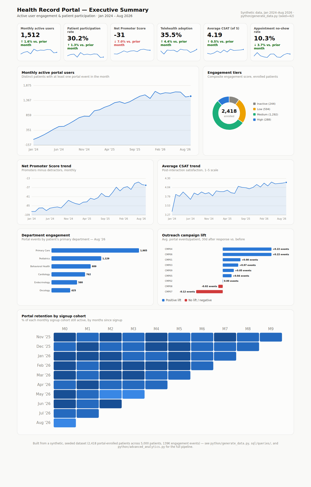

# Health Record Portal Analytics

An end-to-end BI project for a hospital patient-portal program: role-based
executive and operational dashboards, a SQL warehouse tuned for Tableau/
Power BI extraction, and an advanced-analytics layer (engagement scoring +
disengagement-risk modeling) — built on a realistic, seeded synthetic
dataset so the whole pipeline runs and the numbers are reproducible.

- Designed executive summaries and operational views showing active user
  engagement and patient participation.
- Constructed complex SQL queries optimizing data retrieval for Tableau
  dashboards.
- Collaborated with medical outreach teams to define key performance
  indicators and engagement goals.

**Stack:** Tableau · Power BI · SQL (PostgreSQL-flavored, SQLite for local
execution) · Python (pandas, scikit-learn, scipy)



## What's in the dataset

A seeded (reproducible) synthetic hospital portal, Jan 2024 – Aug 2026:

- **5,000 patients** across 4 regions, 4 insurance types, 6 clinical
  departments — **2,418 portal-enrolled** (participation grows over the
  window as onboarding/outreach campaigns land)
- **62 providers**, **~42K clinical encounters** (in-person, telehealth,
  lab, portal message)
- **~139K portal engagement events** (logins, messages, lab-result views,
  refills, education content, survey completions)
- **~4,150 satisfaction surveys** (NPS + CSAT, trending up as the program
  matures)
- **9 outreach campaigns**, **~10K campaign responses**, built to mirror
  the actual KPI conversations a medical outreach team has (onboarding
  pushes, chronic-care check-ins, senior digital-access programs, etc.)

Enrollment, engagement frequency, and satisfaction are all modeled with
realistic skews (age/insurance effects, seasonality, a churn-prone cohort)
rather than uniform randomness — see `docs/architecture.md` for details.

## Project structure

```
python/
  generate_data.py        Synthetic data generator (seed=42, reproducible)
  etl_pipeline.py          Loads raw CSVs into a SQLite warehouse, runs sql/queries/
  advanced_analytics.py    Engagement scoring, churn model, significance test
  build_dashboard.py       Renders dashboards/executive_summary.html
sql/
  schema.sql               Star schema DDL (dims + facts + indexes)
  queries/                 8 CTE/window-function queries powering every dashboard
data/
  raw/                     Generated source CSVs
  processed/               BI-ready extracts + the SQLite warehouse
tableau/                   Tableau build spec: connections, calculated fields
powerbi/                   Power BI build spec: DAX measures, Power Query M
dashboards/
  executive_summary.html   Self-contained static executive dashboard
docs/
  architecture.md           Pipeline diagram + design notes
  kpi_dictionary.md          Every KPI's definition + source of truth
outputs/
  model_metrics.md           Churn model + t-test results
  figures/                   ROC curve, feature importance, retention heatmap, etc.
```

## Quickstart

```bash
cd python
pip install -r requirements.txt
python generate_data.py        # -> data/raw/*.csv
python etl_pipeline.py         # -> data/processed/health_portal.db + curated CSVs
python advanced_analytics.py   # -> engagement scores, churn model, figures
python build_dashboard.py      # -> dashboards/executive_summary.html
```

Then open `dashboards/executive_summary.html` directly in a browser, or
connect Tableau/Power BI to `data/processed/*.csv` following
`tableau/README.md` / `powerbi/README.md`.

## Dashboards & views

| View | Where | Audience |
|---|---|---|
| Executive Summary (MAU, participation, NPS/CSAT, telehealth adoption) | `dashboards/executive_summary.html`, Tableau/Power BI tab 1 | Hospital leadership |
| Engagement Deep-Dive (tiers, department heatmap, cohort retention) | Tableau/Power BI tab 2 | Portal/product team |
| Operational View (no-show rate, telehealth adoption by department) | Tableau/Power BI tab 3 | Support/ops leadership |
| Outreach & Campaigns (engagement rate, campaign lift) | Tableau/Power BI tab 4 | Medical outreach team |

## Advanced analytics

`python/advanced_analytics.py` builds on the warehouse to answer three
questions the dashboards alone can't:

1. **Who's engaged, and how much?** — a 0–100 composite engagement score
   (recency + frequency + depth + breadth) and a 4-tier segmentation,
   exported for use as a Tableau/Power BI filter dimension.
2. **Who's about to churn?** — a disengagement-risk classifier (logistic
   regression vs. random forest, ROC-AUC ~0.95 on this dataset) with
   feature importances, so the outreach team gets a ranked re-engagement
   list instead of a flat metric.
3. **Does telehealth adoption actually move engagement?** — a Welch's
   t-test comparing engagement scores for telehealth adopters vs. not.

Full results: `outputs/model_metrics.md`; figures in `outputs/figures/`.

## Notes on scope

Tableau Desktop and Power BI Desktop are licensed, GUI-only, closed-format
tools that can't be authored headlessly in this environment, so `tableau/`
and `powerbi/` are complete **build specs** — data sources, model
relationships, DAX measures, Power Query M, and calculated fields — rather
than committed `.twbx`/`.pbix` binaries. Given either tool and the CSVs in
`data/`, each dashboard comes together in well under an hour by following
those READMEs. The static HTML dashboard (`dashboards/executive_summary.html`)
renders the same executive-summary story with zero dependencies, so the
project has a runnable, viewable deliverable without either tool installed.
