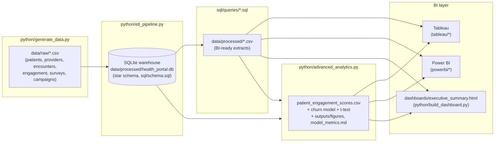

# Architecture

End-to-end pipeline: synthetic source data → SQL warehouse → curated BI
extracts → Tableau / Power BI / the static executive dashboard, with an
advanced-analytics layer branching off the warehouse.



## Layers

1. **Synthetic source data** (`python/generate_data.py`) — a seeded,
   reproducible generator producing 5,000 patients, 62 providers, 6
   departments, 9 outreach campaigns, ~42K clinical encounters, ~139K
   portal engagement events, ~4K satisfaction surveys, and ~10K campaign
   responses across Jan 2024–Aug 2026. Enrollment propensity, engagement
   frequency, and satisfaction trends are all modeled with realistic
   skews (age/insurance effects on adoption, seasonal dips, a churn-track
   cohort, improving NPS/CSAT over time) rather than uniform noise.
2. **Warehouse** (`sql/schema.sql`, loaded by `python/etl_pipeline.py`) —
   a conformed star schema: `dim_patients`, `dim_providers`,
   `dim_departments`, `dim_campaigns`, `dim_date` around
   `fact_encounters`, `fact_portal_engagement`,
   `fact_satisfaction_surveys`, `fact_campaign_responses`. Indexed for the
   date-range + department/patient rollups the BI layer runs most.
3. **Query library** (`sql/queries/`) — eight CTE/window-function queries
   that pre-aggregate the warehouse into the exact grain each dashboard
   needs (MAU, participation, department engagement, cohort retention,
   ops KPIs, campaign lift, satisfaction trend, and the one-row-per-month
   executive summary). These are what `etl_pipeline.py` materializes to
   `data/processed/*.csv` and what Tableau/Power BI connect to directly.
4. **Advanced analytics** (`python/advanced_analytics.py`) — a per-patient
   composite engagement score and tier, a disengagement-risk
   (logistic regression + random forest) model, and a Welch's t-test on
   telehealth adoption vs. engagement. Outputs feed back into the BI
   layer as `patient_engagement_scores.csv` and stand alone as
   `outputs/model_metrics.md` + `outputs/figures/*.png`.
5. **BI layer** — three presentations of the same curated data:
   Tableau (`tableau/`) and Power BI (`powerbi/`) build specs (DAX/M/
   calculated fields + connection instructions, since neither tool can be
   authored headlessly here), and a dependency-free static HTML
   executive dashboard (`dashboards/executive_summary.html`, generated by
   `python/build_dashboard.py`) that renders the same KPIs as inline SVG.

## Reproducing the pipeline

```bash
cd python
pip install -r requirements.txt
python generate_data.py        # -> data/raw/*.csv
python etl_pipeline.py         # -> data/processed/health_portal.db + *.csv
python advanced_analytics.py   # -> patient_engagement_scores.csv, outputs/
python build_dashboard.py      # -> dashboards/executive_summary.html
```

Every step is deterministic (seed=42), so re-running regenerates
byte-identical CSVs and the same dashboard.
